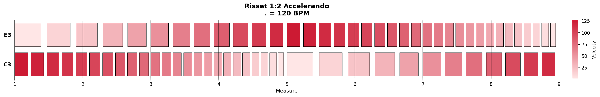
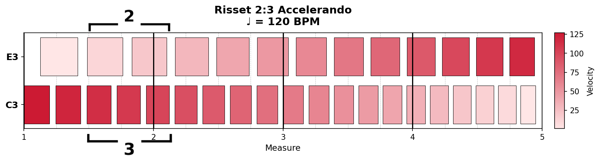
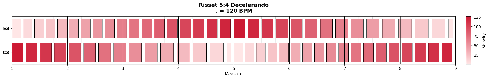

# risset

**Polyrhythmic Risset rhythm MIDI generator**

Creates MIDI files that produce the illusion of perpetual acceleration or deceleration using Risset rhythms with arbitrary tempo ratios.

## Background

The Risset rhythm is the temporal equivalent of Shepard tones. Multiple streams play the same pattern at different tempos, with amplitude crossfades creating the perception of continuous tempo change. When looped, the rhythm appears to accelerate (or decelerate) forever.

A **metabar** is the fundamental loopable unit of a Risset rhythm—the period over which the perceived tempo changes by the given ratio and all stream phases return to their starting state (Stowell, 2011).

Traditional Risset rhythms use **tempo octaves** (2:1 ratio). **Polyrhythmic Risset rhythms** extend this to arbitrary ratios like 3:2, 5:4, or 3:5, as explored by Dmitri Volkov (2023).

## Quick Start

```bash
pip install midiutil
python risset.py --ratio 2/1 --direction accel --measures 8
```

## How It Works

Two layers play at different tempos with opposing velocity curves:
- **Layer 1** fades out (velocity 127→1) while its tempo changes
- **Layer 2** fades in (velocity 1→127) at a different tempo

At the metabar boundary, the fading-in layer has reached the starting tempo of the fading-out layer, creating a seamless loop.


*Classic 2:1 Risset rhythm (arc mode). Darker = louder. Notice how the velocity crossfade creates the illusion of continuous acceleration.*

## Output Modes

| Mode | Output | Description |
|------|--------|-------------|
| **Arc** (default) | 2 metabars | Each pitch completes a full velocity arc. Pitches swap at the seam. |
| **Ramp** (`--ramp`) | 1 metabar | Single crossfade. Building block for composition. |

`--measures` always equals your output length.

**Arc mode** (2 metabars):


**Ramp mode** (1 metabar):


## Usage

```bash
# Classic 2:1 acceleration (8 measures)
python risset.py --ratio 2/1 --direction accel --measures 8

# Polyrhythmic 3:2 acceleration
python risset.py --ratio 3/2 --direction accel --measures 8

# Deceleration with 3:5 ratio
python risset.py --ratio 3/5 --direction decel --measures 8

# Single metabar (ramp mode)
python risset.py --ratio 2/1 --direction accel --measures 4 --ramp
```

## Parameters

| Parameter | Default | Description |
|-----------|---------|-------------|
| `--ratio` | 2/1 | Tempo ratio between layers |
| `--direction` | (required) | `accel` or `decel` |
| `--measures` | 4 | Output length in measures |
| `--bpm` | 120 | Base tempo |
| `--ramp` | off | Output single metabar |
| `--pitch-low` | 60 | MIDI note for layer 1 |
| `--pitch-high` | 64 | MIDI note for layer 2 |
| `-o` | auto | Output filename |

## Examples

See the `examples/` folder for ready-to-use MIDI files covering common ratios.

**Polyrhythmic 5:4 Decelerando:**


## References

- Stowell, D. (2011). "Scheduling and Composing with Risset Eternal Accelerando Rhythms." *Proceedings of the International Computer Music Conference*.
- Risset, J.C. (1986). "Pitch and rhythm paradoxes." *Journal of the Acoustical Society of America*, 80(3), 961-962.
- Volkov, D. (2023). "Risset Polyrhythm." https://www.dmitrivolkov.com/misc/risset-polyrhythm/

## License

MIT

## About the Author

Nathan Turczan is a composer and creative technologist based in Los Angeles, CA. You can find his website at [nathanturczan.com](https://nathanturczan.com), follow him on Instagram [@nathan_turczan](https://www.instagram.com/nathan_turczan/), or reach him at nathanturczan@gmail.com.
